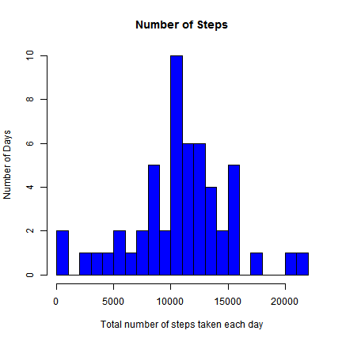
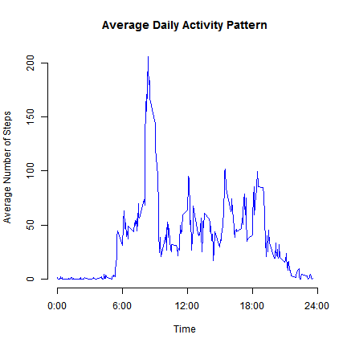
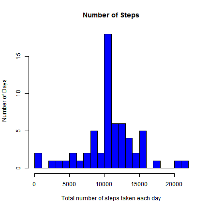
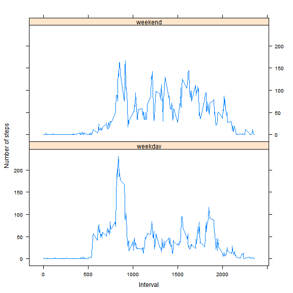

# Reproducible Research: Peer Assessment 1
Author:Minhazul Islam Sk;
Document Created on 13/8/2014;

## Loading and preprocessing the data

Load the data from csv file


```r
data <- read.csv("activity.csv", header = T)
```

Process the raw data: create a subset by removing NA 

```r
processed_data <- subset(data, is.na(data$steps) == F)
```

## What is mean total number of steps taken per day?

### 1. Make a histogram of the total number of steps taken each day

Computing the total number of steps taken each day


```r
library(plyr)
totalPerDay <- ddply(processed_data, .(date), summarise, steps=sum(steps))
```

Plot the Histogram


```r
hist(totalPerDay$steps, breaks = 20, main="Number of Steps", 
     xlab="Total number of steps taken each day", ylab = "Number of Days", col="blue")
```

 
### 2. Calculate and report the mean and median total number of steps taken per day

Computing the mean number of steps taken per day

```r
mean(totalPerDay$steps)
```

```
## [1] 10766
```

Computing the median number of steps taken per day

```r
median(totalPerDay$steps)
```

```
## [1] 10765
```

## What is the average daily activity pattern?

### 1. Make a time series plot (i.e. type = "l") of the 5-minute interval (x-axis) and the average number of steps taken, averaged across all days (y-axis)

Computing the average number of steps taken in each 5-minite intervals

```r
averagePerInterval <- ddply(processed_data, .(interval), summarise, steps=mean(steps))
```

Plotting the time series representation 


```r
plot(averagePerInterval$interval, averagePerInterval$steps,axes = F, type="l", col="blue", xlab="Time", ylab="Average Number of Steps",
     main="Average Daily Activity Pattern")
axis(1,at=c(0,600,1200,1800,2400), label = c("0:00","6:00","12:00","18:00","24:00"))
axis(2)
```

 
### 2. Which 5-minute interval, on average across all the days in the dataset, contains the maximum number of steps?


```r
averagePerInterval[which.max(averagePerInterval$steps),]
```

```
##     interval steps
## 104      835 206.2
```

The interval from 8:35 to 8:40 on average across all the days in the dataset, contains the maximum number of steps

## Imputing missing values

### 1. Calculate and report the total number of missing values in the dataset (i.e. the total number of rows with NAs)
Total number of missing values in the dataset

```r
sum(is.na(data$steps))
```

```
## [1] 2304
```

### 2.Devise a strategy for filling in all of the missing values in the dataset. The strategy does not need to be sophisticated. 

We can substitute the NA's with average value for that 5-min interval

### 3. Create a new dataset that is equal to the original dataset but with the missing data filled in.


```r
imputed <- data

for (i in 1:nrow(imputed)){
    if (is.na(imputed$steps[i])){
        imputed$steps[i] <- averagePerInterval$steps[which(imputed$interval[i] == averagePerInterval$interval)]}
}

imputed <- arrange(imputed, interval)
```

### 4. Make a histogram of the total number of steps taken each day and Calculate and report the mean and median total number of steps taken per day. Do these values differ from the estimates from the first part of the assignment? What is the impact of imputing missing data on the estimates of the total daily number of steps?

Computing the total number of steps taken each day

```r
totalPerDayImputed <- ddply(imputed, .(date), summarise, steps=sum(steps))
```

Plot the Histogram

```r
hist(totalPerDayImputed$steps, breaks = 20, main="Number of Steps", xlab="Total number of steps taken each day", ylab = "Number of Days", col="blue")
```

 

Calculate and report the mean and median total number of steps taken per day on the imputed dataset:

```r
mean(totalPerDayImputed$steps)
```

```
## [1] 10766
```


```r
median(totalPerDayImputed$steps)
```

```
## [1] 10766
```

Test does these values differ from thoes in the first part:

```r
abs(mean(totalPerDay$steps)-mean(totalPerDayImputed$steps))
```

```
## [1] 0
```

```r
abs(median(totalPerDay$steps)- median(totalPerDayImputed$steps))/median(totalPerDay$steps)
```

```
## [1] 0.0001104
```

Thus the mean didn't change after the imputing, the median slightly changed about 0.1% of the original value.

Test how total steps taken per day differ:


```r
totalDifference <- sum(imputed$steps) - sum(processed_data$steps)
totalDifference
```

```
## [1] 86130
```

Imputing the dataset cause the estimation on total steps per day to increase


## Are there differences in activity patterns between weekdays and weekends?

### 1. Create a new factor variable in the dataset with two levels -- "weekday" and "weekend" indicating whether a given date is a weekday or weekend day.


```r
Sys.setlocale("LC_TIME", "English") 
```

```
## [1] "English_United States.1252"
```

```r
imputed$weekdays <- weekdays(as.Date(imputed$date))
imputed$weekdays <- ifelse(imputed$weekdays %in% c("Saturday", "Sunday"),"weekend", "weekday")
```

### 2.Make a panel plot containing a time series plot (i.e. type = "l") of the 5-minute interval (x-axis) and the average number of steps taken, averaged across all weekday days or weekend days (y-axis). 

Computing the average for each interval

```r
average <- ddply(imputed, .(interval, weekdays), summarise, steps=mean(steps))
```

Plotting the time series representation 


```r
library(lattice)
xyplot(steps ~ interval | weekdays, data = average, layout = c(1, 2), type="l", xlab = "Interval", ylab = "Number of steps")
```

 
